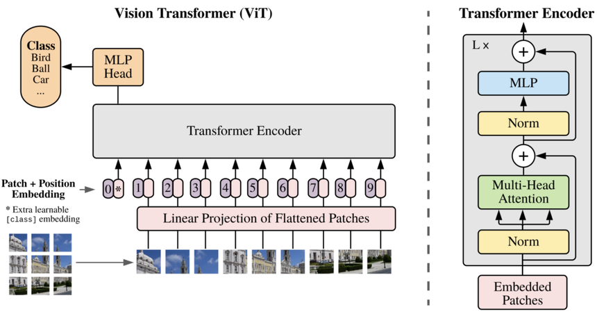

# Transformer_Vision

## Papers 📄
I am reading these papers:

☑️ [**Attention is All You Need (NIPS 2017)**](https://arxiv.org/abs/1706.03762)  
☑️ [**DeiT (Data-efficient Image Transformers)**](https://arxiv.org/abs/2012.12877)  
☑️ [**Efficient Vision Transformers via Fine-Grained Manifold Distillation**](https://arxiv.org/abs/2107.01378)  
☑️ [**NViT (Vision Transformer Compression and Parameter Redistribution)**](https://arxiv.org/abs/2110.04869)  
☑️ [**SiT (Self-slimmed Vision Transformer)**](https://arxiv.org/abs/2111.12624)  

## Goals 🎯

☑️ Develop and implement vision transformer models, including foundational architectures like ViT and DeiT, as well as advanced variants.  
☑️ Investigate and apply different distillation methods to improve the efficiency and performance of vision transformers.  
☑️ Design and execute benchmark tests to assess and compare the performance of various vision transformer models on diverse datasets.  
☑️ Implement optimization techniques such as pruning, quantization, and advanced distillation methods to reduce model size and increase inference speed.  
☑️ Develop comprehensive tutorials and example notebooks to facilitate understanding and practical use of vision transformers for different projects.  
☑️ Fine-tune and evaluate vision transformers for specific real-world scenarios, including medical imaging, autonomous driving, and remote sensing applications.  

