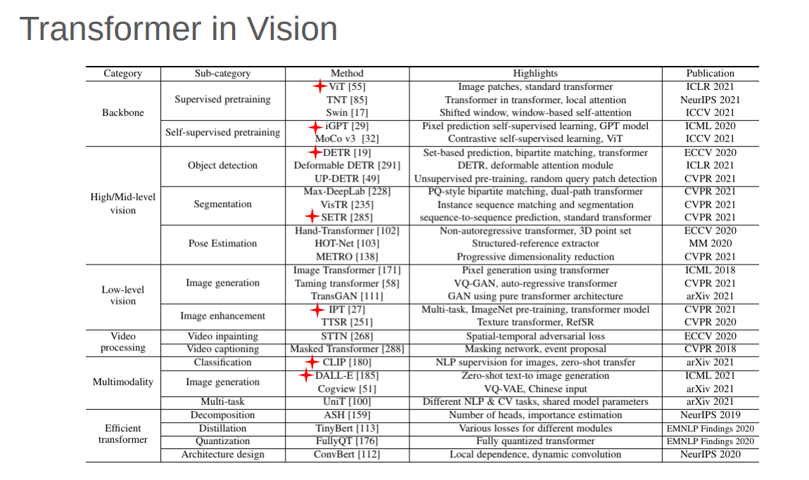

# Transformer_Vision
The Vision Transformer (ViT) model architecture, introduced in a research paper at ICLR 2021 titled “An Image is Worth 16x16 Words: Transformers for Image Recognition at Scale,” marks a significant shift in the field of computer vision. Developed by Neil Houlsby, Alexey Dosovitskiy, and other members of the Google Research Brain Team, ViT applies the Transformer architecture, initially designed for natural language processing, to image recognition tasks by treating images as sequences of patches, akin to words in a sentence.

ViTs have quickly emerged as a competitive alternative to traditional Convolutional Neural Networks (CNNs), which have been the state-of-the-art (SOTA) in image recognition for many years. ViT models outperform the current SOTA CNNs in terms of both computational efficiency and accuracy, demonstrating up to four times better performance. This efficiency and accuracy have been evident across various computer vision tasks, including image classification, object detection, and semantic image segmentation.

Expanding on the success of ViT, the CSWin Transformer introduces further innovations in transformer-based vision models. The CSWin Transformer utilizes a novel technique called Cross-Shaped Window self-attention, which allows it to simultaneously analyze different parts of an image more efficiently. This approach not only speeds up computation but also enhances performance across a range of tasks.

In benchmark tests, the CSWin Transformer has achieved impressive results, surpassing previous SOTA models like the Swin Transformer. Notable achievements include an 85.4% Top-1 accuracy on the ImageNet-1K dataset, a 53.9 box Average Precision (AP) and 46.4 mask AP on the COCO detection task, and a 52.2 mean Intersection over Union (mIoU) on the ADE20K semantic segmentation task. These results underscore the model’s effectiveness in handling diverse vision tasks with high precision.

## Papers 📄
I am reading these papers:

✅[**Attention is All You Need (NIPS 2017)**](https://arxiv.org/abs/1706.03762)  
☑️ [**ViT for Image Recognition at Scale**](https://arxiv.org/abs/2010.11929)  
☑️ [**DeiT (Data-efficient Image Transformers)**](https://arxiv.org/abs/2012.12877)  
☑️ [**Efficient Vision Transformers via Fine-Grained Manifold Distillation**](https://arxiv.org/abs/2107.01378)  
☑️ [**NViT (Vision Transformer Compression and Parameter Redistribution)**](https://arxiv.org/abs/2110.04869)  
☑️ [**SiT (Self-slimmed Vision Transformer)**](https://arxiv.org/abs/2111.12624)  

## Blogs 📝
I am reading these blogs:

☑️ [**Vision Transformers (ViT) in Image Recognition – 2024 Guide**](https://viso.ai/deep-learning/vision-transformer-vit/)  

## Origin and History of Vision Transformer Models
| Date       | Model                | Description                                                                                                  | Vision Transformer? |
|------------|----------------------|--------------------------------------------------------------------------------------------------------------|---------------------|
| 2017 Jun   | Transformer           | A model based solely on an attention mechanism. It demonstrated excellent performance on NLP tasks.           | ❌                  |
| 2018 Oct   | BERT                  | Pre-trained transformer models started dominating the NLP field.                                              | ❌                  |
| 2020 May   | DETR                  | DETR is a simple yet effective framework for high-level vision that views object detection as a direct set prediction problem. | ✅                  |
| 2020 May   | GPT-3                 | The GPT-3 is a huge transformer model with 170B parameters that takes a significant step towards a general NLP model. | ❌                  |
| 2020 Jul   | iGPT                  | The transformer model, originally developed for NLP, can also be used for image pre-training.                 | ✅                  |
| 2020 Oct   | ViT                   | Pure transformer architectures that are effective for visual recognition.                                     | ✅                  |
| 2020 Dec   | IPT/SETR/CLIP         | Transformers have been applied to low-level vision, segmentation, and multimodality tasks, respectively.      | ✅                  |
| 2021 - today | ViT Variants        | Several ViT variants include DeiT, PVT, TNT, Swin, and CSWin (2022)                                           | ✅                  |

## Goals 🎯

☑️ Develop and implement vision transformer models, including foundational architectures like ViT and DeiT, as well as advanced variants.  
☑️ Investigate and apply different distillation methods to improve the efficiency and performance of vision transformers.  
☑️ Design and execute benchmark tests to assess and compare the performance of various vision transformer models on diverse datasets.  
☑️ Implement optimization techniques such as pruning, quantization, and advanced distillation methods to reduce model size and increase inference speed.  
☑️ Develop comprehensive tutorials and example notebooks to facilitate understanding and practical use of vision transformers for different projects.  
☑️ Fine-tune and evaluate vision transformers for specific real-world scenarios, including medical imaging, autonomous driving, and remote sensing applications.  

## GitHub Repos 📦

[**Google Research Vision Transformer**](https://github.com/google-research/vision_transformer)

