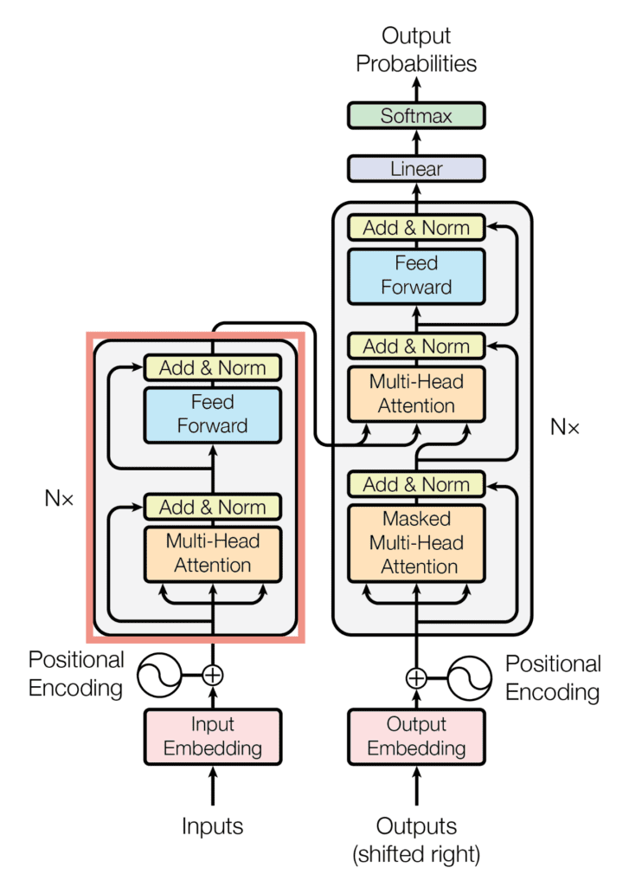
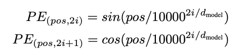
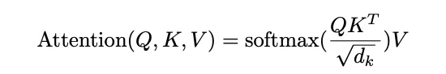
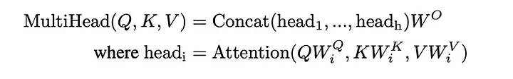
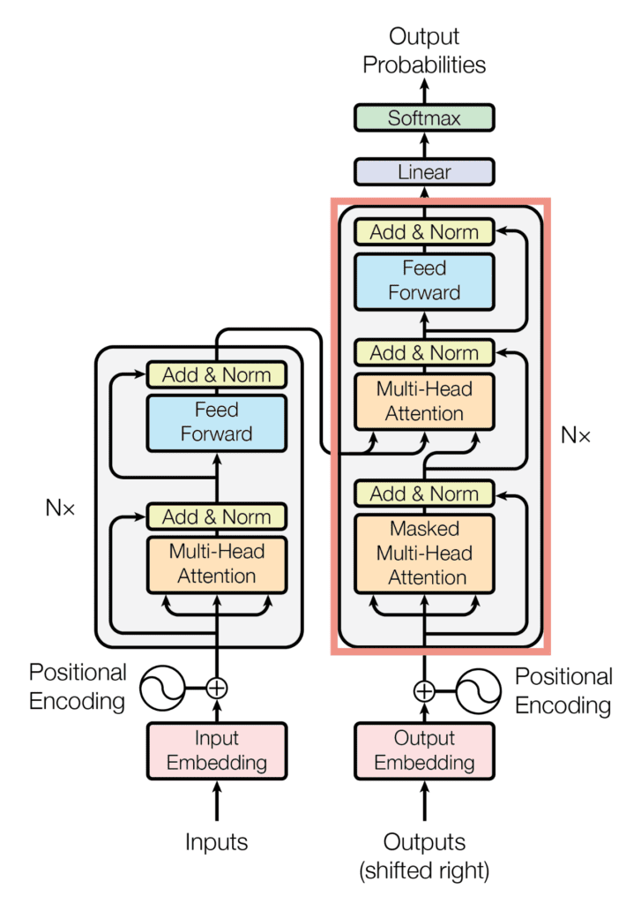
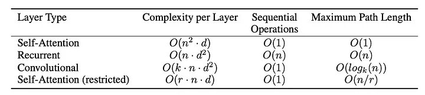

# LITERATURE REVIEW: ATTENTION IS ALL YOU NEED

## INTRODUCTION

The **Attention Is All You Need** paper was a breakthrough for NLP, particularly in the fields of Language Modeling and Machine Translation. This paper took a different approach by relying entirely on the Attention Mechanism, departing from the state-of-the-art approaches like Recurrent Neural Networks (RNNs), which include long short-term memory (LSTM) and gated recurrent units (GRU). The paper introduces a new model architecture, **Transformers**, which utilizes the attention mechanism instead of recurrence, achieving higher state-of-the-art translation quality. This shift allowed for significant improvements in handling long-range dependencies and enabled more parallelizable computation compared to traditional RNN-based models.

   
*Figure 1: The Transformer - model architecture.*

Before diving into the key concepts of the Transformer model, let's discuss **Recurrent Models** and the **Issues with Recurrent Models**.

## RECURRENT MODELS

- In NLP, the traditional strategy involves encoding sentences with bidirectional LSTM models. For example, a source sentence in machine translation.
- The output (such as a parse, sentence, or summary) is also defined as a sequence and generated using an LSTM model.

## ISSUES WITH RECURRENT MODELS

### Linear Interaction Distance

- Recurrent Neural Networks (RNNs) are unrolled left-to-right, encoding linear locality, meaning nearby words often influence each other's meaning in a sentence.
- RNNs require a number of steps proportional to the sequence length(O(n)) for distant word pairs to interact, making it challenging to learn long-distance dependencies due to gradient problems like vanishing or exploding gradients.
- The linear order of words is intrinsic to the model, as RNNs must be unrolled throughout the sequence. However, this linear order isn't always the most effective way to interpret sentences, especially for capturing long-range dependencies.

### Lack of Parallelizability

- RNNs have forward and backward passes with operations that cannot be parallelized efficiently, proportional to the sequence length.
- This lack of parallelizability limits training efficiency and scalability, as GPUs cannot perform many independent computations simultaneously.

## ATTENTION
- Attention is a mechanism that allows models to focus on specific parts of the input data while performing a task. Attention mechanisms enable the model to assign varying levels of importance to different parts of the input instead of treating all input equally. 
- Attention model treats each word's representation as **query** to access and incorporate information for a set of **values**. For example, in a machine translation system, the set of values were all encoder states for the source sentences.
- The number of unparallelizable operation doesn't increase sequence length. RNNs process inputs sequentially. Each step depends on the previous one. This means that for a sequence of length n, there are n steps that must be executed one after another. Therefore, the number of unparallelizable operations increases with the length of the sequence. Transformers, on the other hand, use self-attention mechanisms. Self-attention computes relationships between all pairs of words in the input sequence simultaneously. Thus, each layer's operations in a Transformer can be executed in parallel across all words in the sequence. The computation of attention values doesn't need to happen sequentially, so the number of unparallelizable operations does not increase as the sequence length increases.
- Maximum interaction distance is O(1) since all the words interact at every layer.

## ATTENTION MECHANISM BASICS
Attention mechanisms can be explained using three essential components:

### 1. Query(Q):
The query is a vector that represents what the model is currently looking at. It is often derived from the model's internal state or the previous output.

### 2. Key(K):
The key is another vector that represents the element in the input data. It can be thought of as a set of "pointers" to specific parts of the input.

### 3. Value(V):
The value is a vector that represents the actual information associated with each element in the input data. 

## MODEL ARCHITECUTRE
The Transformer architecture follows an encoder-decoder structure but does not rely on recurrence and convulations in order to generate an output. The encoder is used to map an input sequence to a sequence of continuous representations, which is then fed into a decoder. The decoder is used to receive the ouput of the encoder together with the decoder output at the previous time step to generate an output sequence.

### FRAMEWORK
- Left: The encoder maps an input sequence of symbol representations **(x1, …, xn)** to a sequence of continuous representations **z=(z1, …, zn)**.
- Right: Given **z**, the decoder then generates an output sequence **(y1, …, ym)** of symbols one element at a time. At each step the model is auto-regressive, consuming the previously generated symbols as additional input when generating the next.

### THE ENCODER

  
*The encoder block of the Transformer architecture*

The encoder consists of a stack of N = 6 identical layers, where each layer is composed of two sublayers. Inputs are translated to word vectors of dimensional = 512 through the input embedding layer and injected with positional encoding, which adds information about the order of the sequence using the following equations:
  
*The Transformer Encoder Decoder Stack* 

The encoder are all identical in structure (yet they do not share weights). Each one is broken down into two sub-layers:

  
*The Transformer encoder sub-layers* 

The encoder's input is first passed through a self-attention layer - a layer that helps the encoder look at other words in the input sentence as it encodes a specific word. The outputs of the self-attention layer are fed to a feed-forward neural network. The exact same feed-forward network is independently applied to each position. The decoder has both these layers, but between them is an attention layer that helps the decoder focus on relevant parts of the input sentence (similar what attention does in seq2seq models.)  
  
*Transformer Encoder-Decoder layer* 

where i is the pos = position and i = dimensionality. This gives each word information about their relative position in the wide range defined by the sinusoid and helps remedy the lack of recurrence in the model.

 

Our data is then fed into the first of six encoder units. Within an encoder unit, the input is matrix multiplied into three matrices of Key (K), Query (Q), and Value (V), all of which are fed into the attention function.

To prevent repeated matrix multiplication to explode the result, it is scaled by according to the dimensionality of the key matrix. Multi-head attention is a slight tweak where instead of applying the function on the entire input, the keys, queries, and values are first linearly projected onto dimensions h times smaller than original input dimensionality. Each of h layers is then computed in parallel and their outputs are concatenated and linearly projected to yield the final value. In this paper, h = 8.

The output of the Multi-Head Attention layer flows into a standard ReLU-activated and Adam-optimized feed-forward neural network. Each layer employs a residual connection to facilitate backpropagation and prevent exploding gradients. At the end of each encoder subunit, there is a dropout layer using a rate of 0.1 (not shown in the diagram).

## THE RESIDUALS
Each sub-layer (self-attention, ffnn) in each encoder has a residual connection around it, and is followed by a **layer-normalization** step.  
  
*The Residual Layer-Normalization*

If we're to visualize the vector and the layer-norm operation associated with self attention:
)  
*Vector and the layer-normalization operation associated with self-attention*

This goes for the sub-layer of the decoder as well. Think of a Transformer of 2 stacked encoders and decoders, it would look something like this: 
 
*Transformer of 2 stacked encoders and decoders*

## THE DECODER

*The decoder block of the Transformer architecture*

The decoder has a similar structure to the encoder but is tweaked slightly. First, a Multi-Head Attention layer is inserted between the two existing layers which takes Queries from the previous decoder layer and Keys and Values from the output of the stack of six encoders. The initial Multi-Head Attention layer is modified by using masks so that the only encountered information from the past is used (also known as the auto-regressive property).

Finally, the decoder outputs a vector of floats which is fed through a last deep feed-forward neural network which, after passing through a Softmax function, gives a vector of probabilities for each English word. The word with the highest probability is picked, and word-by-word, the translated sequence is generated.

## RESULTS

By eliminating recurrence from a well-established encoder-decoder architecture, the paper significantly boosted model performance and computation speed. The most impressive feature of the Transformer, however, was its speed. Refer to the graph below for a visual representation:

Because the hidden dimensionality d needs to be quite large for the model to be sufficiently expressive, the computational complexity of Self-Attention, O(n² ⋅ d), is much smaller compared to that of an RNN, O(n ⋅ d²), or a CNN, O(k ⋅ n ⋅ d²), where n represents the sequence length and k is the filter width. This reduction in complexity allowed the Transformer to train at a significantly lower cost and faster rate than other models, including ensembles.

## RESOURCES
- [REVIEW: ATTENTION IS ALL YOU NEED TRANSFORMER](https://sh-tsang.medium.com/review-attention-is-all-you-need-transformer-96c787ecdec1)
- [The Illustrated Transformer](https://jalammar.github.io/illustrated-transformer/)
