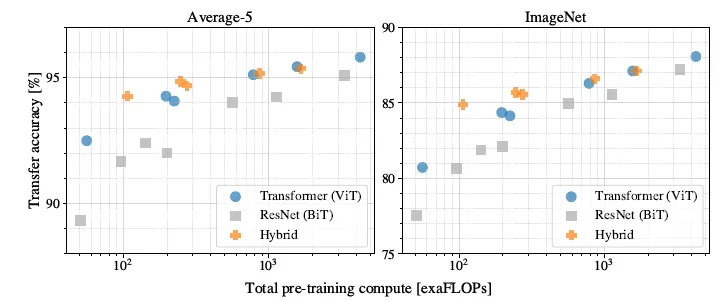
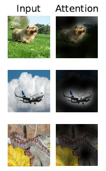

# LITERATURE REVIEW: AN IMAGE IS WORTH 16X16 WORDS:TRANSFORMERS FOR IMAGE RECOGNITION AT SCALE

## INTRODUCTION:
When pre-trained on large amounts of data and transferred to multiple mid-sized or small image recognition benchmarks (ImageNet, CIFAR-100, VTAB, etc.), Vision Transformer (ViT) attains excellent results compared to state-of-the-art convolutional networks while requiring substantially fewer computational resources to train.

Transformers, introduced by Vaswani et al. (2017), have become dominant in natural language processing (NLP) due to their efficiency and scalability. These models are typically pre-trained on large text corpora and fine-tuned for specific tasks, achieving remarkable results with up to 100 billion parameters (Brown et al., 2020).

In contrast, computer vision has largely relied on convolutional neural networks (CNNs) (LeCun et al., 1989; Krizhevsky et al., 2012). Recent attempts to integrate self-attention with CNNs or replace convolutions entirely have faced challenges in scaling and have not yet surpassed traditional architectures (Wang et al., 2018; Ramachandran et al., 2019).

This paper explores applying Transformers directly to images by treating image patches as tokens, similar to NLP. Initial results on datasets like ImageNet show modest performance compared to CNNs but improve significantly with larger datasets. Vision Transformers (ViT), when pre-trained on large datasets like ImageNet-21k or JFT-300M, achieve or surpass state-of-the-art results on several benchmarks.

## RELATED WORK

#### Transformers in NLP 🗣️
- **Vaswani et al. (2017)**: Introduced Transformers for machine translation, which have since become the state-of-the-art for various NLP tasks.
- **BERT (Devlin et al., 2019)**: Utilizes denoising self-supervised pre-training.
- **GPT Series (Radford et al., 2018; 2019; Brown et al., 2020)**: Uses language modeling as a pre-training task.

#### Transformers for Images 🖼️
- **Parmar et al. (2018)**: Applied self-attention locally to reduce computational cost.
- **Hu et al. (2019); Ramachandran et al. (2019); Zhao et al. (2020)**: Replaced convolutions with local multi-head self-attention.
- **Child et al. (2019)**: Introduced Sparse Transformers with scalable approximations for global self-attention.
- **Weissenborn et al. (2019); Ho et al. (2019); Wang et al. (2020a)**: Explored attention in blocks or along individual axes to improve scalability.

#### Cordonnier et al. (2020) 🔍
- **Model Overview**: Extracts 2 × 2 image patches and applies full self-attention. This approach is similar to ViT but limited to small-resolution images.

#### CNNs and Self-Attention 🤖
- **Bello et al. (2019)**: Augmented CNN feature maps with self-attention for image classification.
- **Hu et al. (2018); Carion et al. (2020)**: Used self-attention to further process CNN outputs for object detection and other tasks.
- **Wu et al. (2020)**: Integrated self-attention with CNNs for image classification.
- **Chen et al. (2020c); Lu et al. (2019); Li et al. (2019)**: Combined CNNs with self-attention for unified text-vision tasks.

#### Image GPT (Chen et al., 2020a) 🖼️🤖
- **Approach**: Applies Transformers to image pixels after reducing resolution and color space. Achieved a maximum accuracy of 72% on ImageNet through unsupervised training.

#### Scaling and Dataset Size 📈
- **Mahajan et al. (2018); Touvron et al. (2019); Xie et al. (2020)**: Demonstrated state-of-the-art results with larger datasets.
- **Sun et al. (2017)**: Studied CNN performance scaling with dataset size.
- **Kolesnikov et al. (2020); Djolonga et al. (2020)**: Explored CNN transfer learning with large datasets like ImageNet-21k and JFT-300M.

#### Paper Contribution 🚀
- Focuses on applying Transformers to large-scale image recognition, specifically using large datasets such as ImageNet-21k and JFT-300M, and achieving state-of-the-art results compared to traditional ResNet-based models.

## OUTLINE
- Vision Transformer(ViT)
- Hybrid Architecture
- Experimental Results

## VISION TRANSFORMER (ViT)
  
*Vision Transformer Network Architecture*

- To handle 2D images, the image x is reshaped from H×W×C into a sequence of flattened 2D patches xp, with the shape of N×(P²×C), where (H, W) is the resolution of the original image, C is the number of channels, (P, P) is the resolution of each image patch, and N=HW/P² is the resulting number of patches.

- Eq. 1: The Transformer uses constant latent vector size D through all of its layers, so the patches are flattened and map to D dimensions with a trainable linear projection. The output of this projection as the **patch embeddings**.
- Similar to BERT’s [class] token, a learnable embedding is prepended to the sequence of embedded patches (z00=xclass)
- Eq. 4: The state at the output of the Transformer encoder (z0L) serves as the **image representation y**.
- Both during pre-training and fine-tuning, a classification head is attached to z0L. The classification head is implemented by a MLP with one hidden layer at pre-training time and by a single linear layer at fine-tuning time.
- Position embeddings are added to the patch embeddings to retain positional information. Standard learnable 1D position embeddings is used.
- Eq. 2, 3: The Transformer encoder consists of alternating layers of multiheaded self-attention (MSA) and MLP blocks.
- Layernorm (LN) is applied before every block, and residual connections after every block. The MLP contains two layers with a GELU non-linearity.
- The “Base” and “Large” models are directly adopted from BERT and the larger “Huge” model is added.
- ViT-L/16 means the “Large” variant with 16×16 input patch size. Note that the Transformer’s sequence length is inversely proportional to the square of the patch size, and models with smaller patch size are computationally more expensive.
- Typically **ViT is pre-trained on large datasets, and fin-tuned to (smaller) downstream tasks**. For this, the pre-trained prediction head is removed and a zero-initialized *DxK* feedforward layer is attached, where *K* is the number of downstream classes.
- It is often beneficial to **fine-tune at higher resolution than pre-training**, as in FixRes. When feeding images of higher resolution, the patch size is kept the same, which results in a larger effective sequence length.
- The Vision Transformer can handle arbitrary sequence lengths (up to memory constraints), however, the pre-trained position embeddings may no longer be meaningful. Therefore 2D interpolation of the pre-trained position embeddings is performed, according to their location in the original image. (This resolution adjustment and patch extraction are the only points at which an inductive bias about the 2D structure of the images is manually injected into the Vision Transformer).

#### Inductive Bias
- Inductive bias in the context of Vision Transformers (ViTs) refers to the inherent assumptions or constraints imposed by the model architecture or design that guide its learning process. 
- ViTs split images into fixed-size patches and linearly embed these patches into a sequence of tokens. This design choice assumes that local spatial information within these patches is sufficient for capturing visual patterns, and it introduces a bias towards local structure within images.
- The self-attention mechanism in ViTs allows the model to weigh the importance of different tokens relative to each other. This design introduces an inductive bias towards capturing long-range dependencies and global relationships within the image, assuming that contextual information across the entire image is important for visual understanding.
-  Since transformers do not inherently capture spatial information, ViTs use positional encodings to inject information about the relative or absolute position of patches into the model. This adds a bias towards maintaining spatial relationships between patches.
-  The transformer architecture’s layers, such as multi-head self-attention and feed-forward networks, embed certain biases related to how features are aggregated and processed. These layers assume that feature interactions and transformations can be learned through attention mechanisms and dense layers.
- Vision Transformer has much less image-specific inductive bias than CNNs.

## HYBRID ARCHITECTURE
- As an alternative raw image patches, **the input sequence can be formed from feature maps of a CNN**.
- Eq. 1: In this hybrid model, the patch embedding projection *E* is applied to patches extracted rom a CNN feature map. As a special case, the patches can have spatial size 1x1.
- The classification input embedding and position embeddings are added as described above.
- The representation learning capabilities of ResNet, ViT, and the hybrid are to be evaluated.

## EXPERIMENTAL RESULTS
#### SOTA Comparison
  
*Comparison with state of the art on popular image classification benchmarks. The number of TPUv3-core-days is the number of TPU v3 cores (2 per chip) used for training multiplied by the training time in days.*

- The smaller ViT-L/16 model pre-trained on JFT-300M outperforms BiT-L on all tasks, while requiring substantially less computational resources to train. 
- The larger model, **ViT-H/14**, further improves the performance, especially on the more challenging datasets.
- ViT models still look substantially less compute to pre-train.

  
*Breakdown of VTAB performance in Natural, Specialized, and Structured task groups.*

- BiT, VIVI — a ResNet co-trained on ImageNet and YouTube, and S4L — supervised plus semi-supervised learning on ImageNet.
- ViT-H/14 outperforms BiT-R152×4, and other methods, on the Natural and Structured tasks.
 
On the Specialized the performance of the top two models is similar.

#### Pretraining Data Requirement
  
*Left: Transfer to ImageNet, Right: Linear few-shot evaluation on ImageNet versus pre-training size (ViT-b is ViT-B with all hidden dimensions halved.)*

- **Left**: When pre-trained on the smallest dataset, ImageNet, ViT-Large models underperform compared to ViT-Base models, despite (moderate) regularization.
- With ImageNet-21k pre-training, their performances are similar.
- Only with JFT-300M, we can see the full benefit of larger models.
- The BiT CNNs outperform ViT on ImageNet, but with the larger datasets, ViT overtakes.
- **Right**: Random subsets of 9M, 30M, and 90M as well as the full JFT-300M dataset for pretraining.
- ViT-B/32 is slightly faster than ResNet50; it performs much worse on the 9M subset, but better on 90M+ subsets.
- The same is true for ResNet152×2 and ViT-L/16.

This result reinforces the intuition that the convolutional inductive bias is useful for smaller datasets, but for larger ones, learning the relevant patterns directly from data is sufficient, even beneficial.

#### Scaling Study

  
*Performance versus pre-training compute for different architectures*

- The number of pretraining epochs is from 7 to 14, so that data size does not bottleneck the model's performance.

1. Vision Transformers dominate ResNets on the performance/compute trade-off. ViT uses approximately 2-4× less compute to attain the same performance (average over 5 datasets).
2. Hybrids slightly outperform ViT at small computational budgets, but the difference vanishes for larger models. This result is somewhat surprising, since one might expect convolutional local feature processing to assist ViT at any size.
3. Vision Transformers appear not to saturate within the range tried.

#### Inspecting Vision Transformer

  
*Left: Filters of the initial linear embedding of RGB values of ViT-L/32. Center: Similarity of position embeddings of ViT-L/32. Right: Size of attended area by head and network depth.*
- **Left**: The components resemble plausible basis functions for a low-dimensional representation of the fine structure within each patch.
- **Center**: The model learns to encode distance within the image in the similarity of position embeddings, i.e. closer patches tend to have more similar position embeddings.
- **Right**: The average distance in image space across which information is integrated, based on the attention weights. This “attention distance” is analogous to receptive field size in CNNs.
- Some heads attend to most of the image already in the lowest layers, showing that the ability to integrate information globally is indeed used by the model.

  
*Representative examples of attention from the output token to the input space.*

  
*Further example attention maps*

The model attends to image regions that are semantically relevant for classification.

#### Self-Supervision
- A preliminary exploration is studied on masked patch prediction for self-supervision, mimicking the masked language modeling task used in BERT.

With self-supervised pre-training, the smaller ViT-B/16 model achieves 79.9% accuracy on ImageNet, a significant improvement of 2% to training from scratch, but still 4% behind supervised pre-training.

## RESOURCE
- [2021 ICLR][Vision Transformer, ViT](https://arxiv.org/abs/2010.11929)
- [Review: Vision Transformer (ViT)](https://sh-tsang.medium.com/review-vision-transformer-vit-406568603de0)

